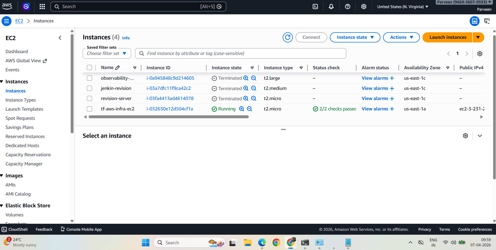
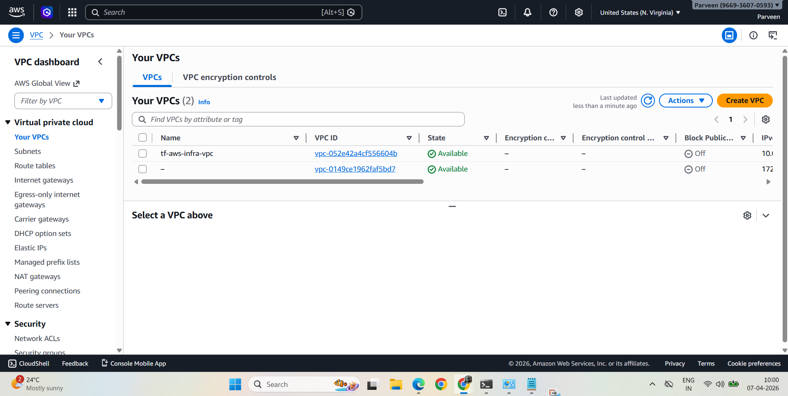
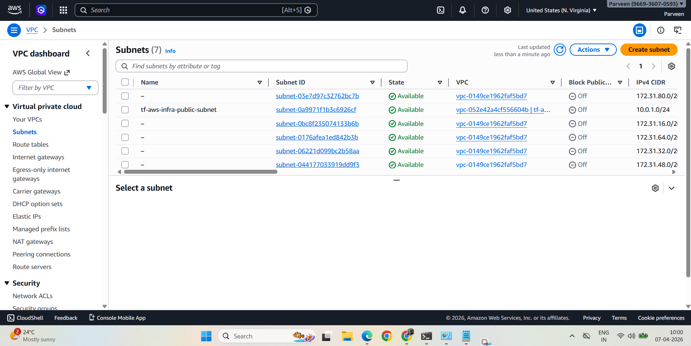
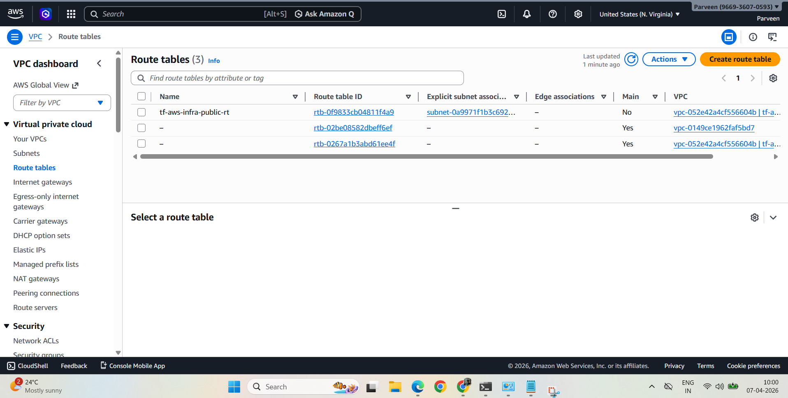
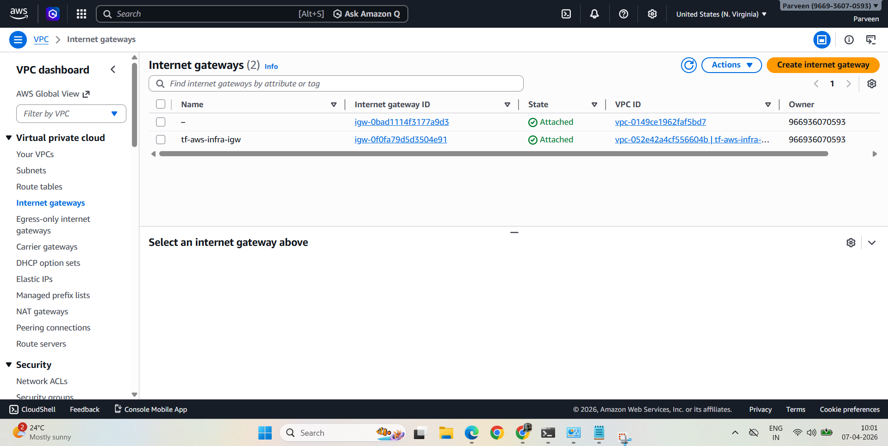
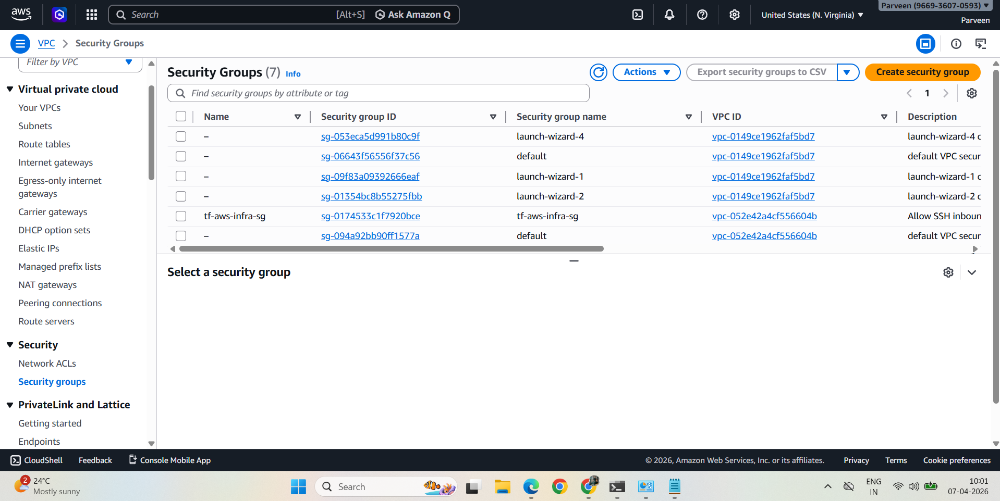

# AWS Infrastructure Provisioning with Terraform

## Overview
This project provisions a complete AWS infrastructure using Terraform (Infrastructure as Code). All resources are created with a single command — no manual clicking in AWS Console.

## Architecture
The following AWS resources are provisioned:
- **VPC** — Isolated network on AWS (CIDR: 10.0.0.0/16)
- **Public Subnet** — Subnet within the VPC (CIDR: 10.0.1.0/24)
- **Internet Gateway** — Enables internet access for the VPC
- **Route Table** — Routes traffic from subnet to internet via IGW
- **Security Group** — Firewall rules allowing SSH (22) and HTTP (80)
- **EC2 Instance** — Amazon Linux 2 t2.micro server
- **S3 Backend** — Remote Terraform state management

## Project Structure
```
terraform-aws-infra/
├── provider.tf      # AWS provider and Terraform version config
├── variables.tf     # Input variables (region, CIDR, AMI, etc.)
├── main.tf          # Core infrastructure resources
├── outputs.tf       # Output values (VPC ID, EC2 IP, etc.)
├── backend.tf       # S3 remote backend configuration
└── Screenshots/     # AWS Console verification screenshots
```

## Prerequisites
- Terraform installed
- AWS CLI configured (`aws configure`)
- AWS account with IAM permissions

## Usage

**Initialize Terraform**
```bash
terraform init
```

**Preview infrastructure**
```bash
terraform plan
```

**Create infrastructure**
```bash
terraform apply
```

**Destroy infrastructure**
```bash
terraform destroy
```

## Screenshots

### EC2 Instance Running


### VPC Created


### Subnet Created


### Route Table


### Internet Gateway


### Security Group


## Outputs
After `terraform apply`, these values are displayed:
- `vpc_id` — ID of the created VPC
- `subnet_id` — ID of the public subnet
- `ec2_instance_id` — ID of the EC2 instance
- `ec2_public_ip` — Public IP of the EC2 instance
- `security_group_id` — ID of the security group

## Troubleshooting
**Issue:** Multiple route tables created with Main = Yes after incomplete terraform destroy

**Cause:** Terraform state was out of sync — partial destroy left orphaned route tables in AWS as main tables for their respective VPCs.

**Fix:** Identified orphaned VPCs via AWS Console, deleted dependent resources manually, then ran terraform destroy to clean remaining state. Going forward, S3 remote backend ensures state is always consistent.

## Tech Stack
Terraform | AWS EC2 | AWS VPC | AWS S3 | AWS IAM | Linux
